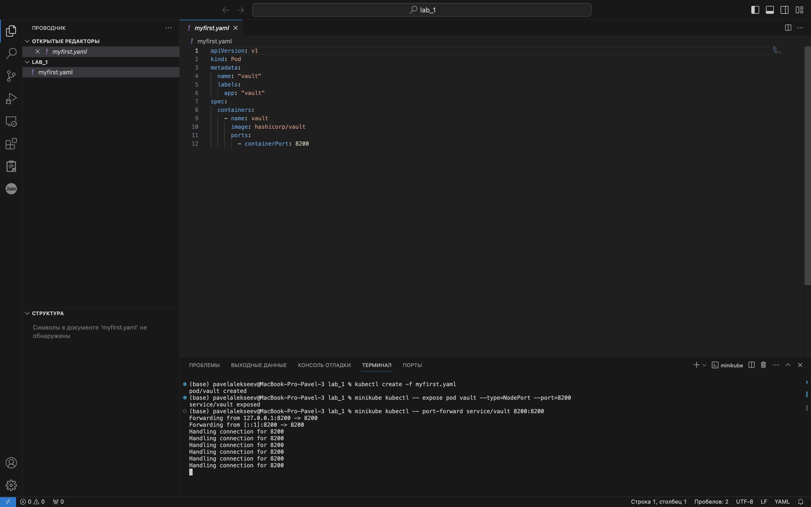
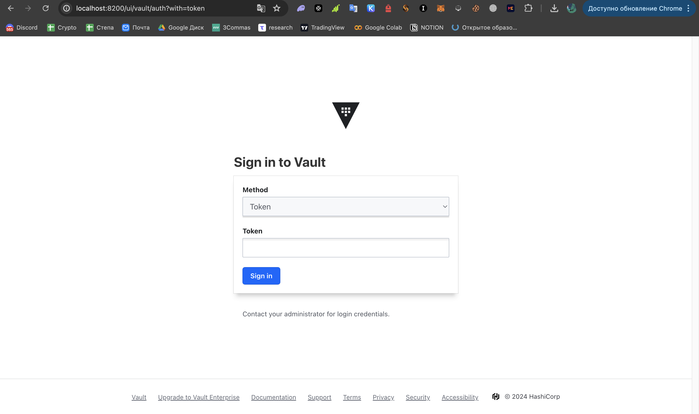
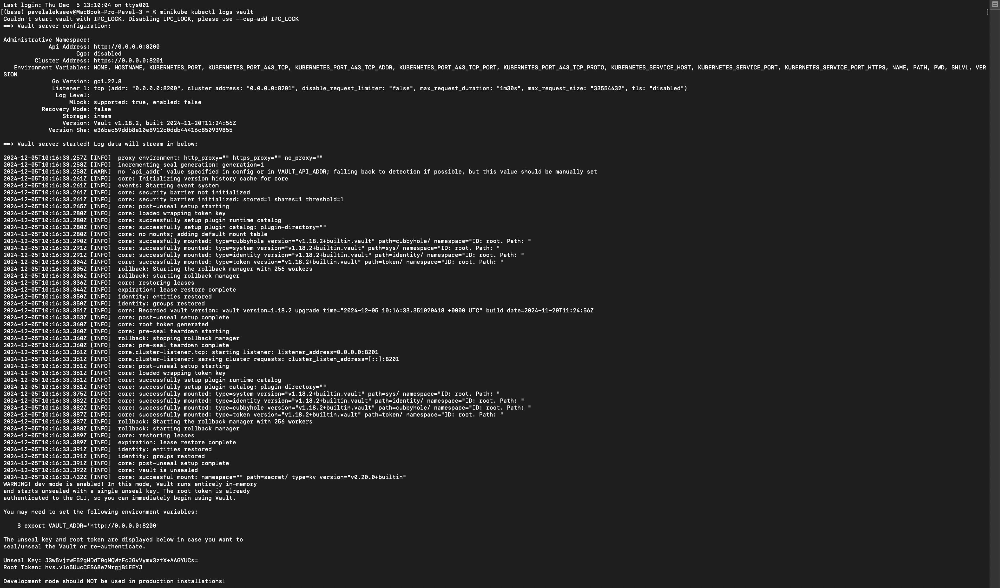
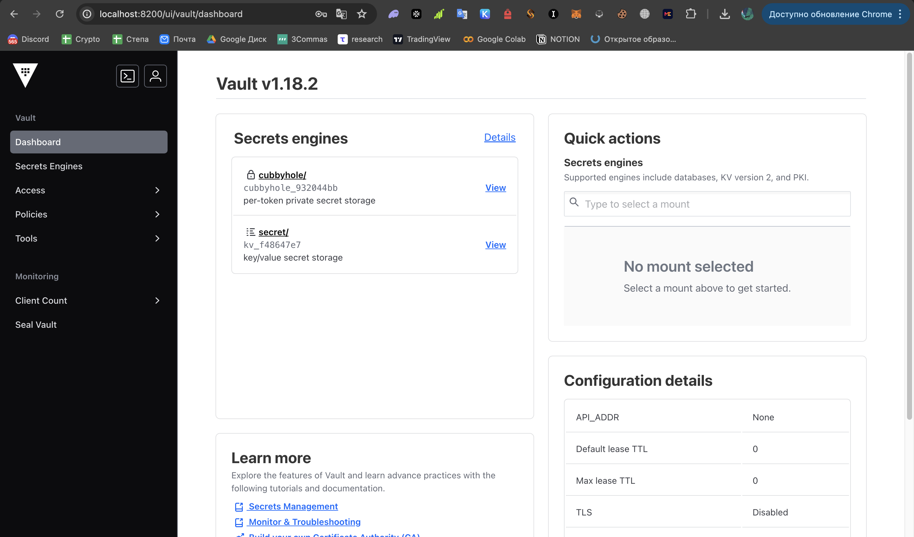
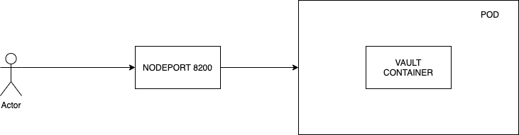

University: [ITMO University](https://itmo.ru/ru/)

Faculty: [FICT](https://fict.itmo.ru)

Course: [Introduction to distributed technologies](https://github.com/itmo-ict-faculty/introduction-to-distributed-technologies)

Year: 2024/2025

Group: K4111c

Author: Alekseev Pavel Alekseevich

Lab: Lab1

Date of create: 04.12.2024

Date of finished: 05.12.2024

## Лабораторная работа №1 "Установка Docker и Minikube, мой первый манифест."

### Описание
Это первая лабораторная работа в которой вы сможете протестировать Docker, установить Minikube и развернуть свой первый "под".

### Цель работы
Ознакомиться с инструментами Minikube и Docker, развернуть свой первый "под".

### Ход работы

- Установить Minikube

``brew install minikube``

- Разворачивание minikube cluster

``minikube start``

### Задание 1
- Создание пода с использованием манифеста
- Создание сервиса для доступа к контейнеру
- Прокидывание порта компьютера в контейнер

### Задание 2 
- Входим в vault используя токен (в логах пода смотрим токен)

### Схема 

### Ответы на вопросы:

1) Что сейчас произошло и что сделали команды ранее? 

Изначально был развернут кластер. Затем, с использованием манифеста, был создан "под", в котором запущен контейнер из образа Vault. 

2) Где взять токен для входа в Vault? 

в логах 
