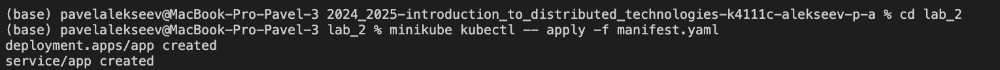
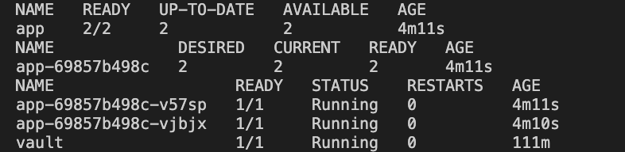
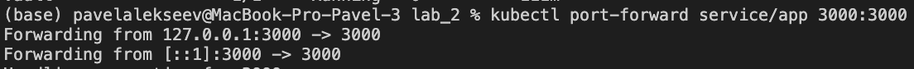
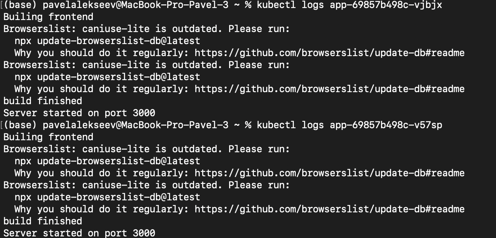
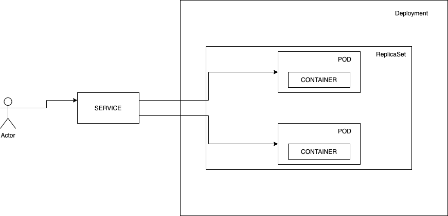

University: [ITMO University](https://itmo.ru/ru/)
Faculty: [FICT](https://fict.itmo.ru)
Course: [Introduction to distributed technologies](https://github.com/itmo-ict-faculty/introduction-to-distributed-technologies)
Year: 2024/2025
Group: K4111с
Author: Alekseev Pavel
Lab: Lab2
Date of create: 04.12.2024
Date of finished: 05.12.2024


# Лабораторная работа №2 "Развертывание веб сервиса в Minikube, доступ к веб интерфейсу сервиса. Мониторинг сервиса."

## Описание
   В данной лабораторной работе вы познакомитесь с развертыванием полноценного веб сервиса с несколькими репликами.

## Цель работы:
   Ознакомиться с типами "контроллеров" развертывания контейнеров, ознакомится с сетевыми сервисами и развернуть свое веб приложение.

## Ход работы:

### 1. Запуск Minikube
``minikube start``

### 2. Был создан манифест deployment.

  ```
  apiVersion: apps/v1
  kind: Deployment
  metadata:
    name: app
    labels:
      app: app
  spec:
    replicas: 2
    selector:
      matchLabels:
        app: app
    template:
      metadata:
        labels:
          app: app
      spec:
        containers:
        - name: itdt-contained-frontend
          image: ifilyaninitmo/itdt-contained-frontend:master
          ports:
          - containerPort: 3000
            name: http
          env:
            - name: REACT_APP_USERNAME
              value: 'Pasha'
            - name: REACT_APP_COMPANY_NAME
              value: 'ITMO'
  ```
 

### 3. Был создан манифест service.

  ```  
  apiVersion: v1
  kind: Service
  metadata:
    name: app
  spec:
    type: NodePort
    ports:
      - port: 3000
        targetPort: 3000
        protocol: TCP
        name: http
    selector:
      app: app
```

### 4. Запуск и подключени.
Запуск: 
`minikube kubectl -- apply -f manifest.yaml`



Проверим при помощи:

```
minikube kubectl -- get deployments
minikube kubectl -- get rs
minikube kubectl -- get pods 
```


Проброс портов:

`kubectl port-forward service/app 3000:3000`



Вопрос: 

Переменные  `REACT_APP_USERNAME`,  `REACT_APP_COMPANY_NAME`  и  `Container name`. Изменяются ли они? Если да, то почему? 

Значения переменных не изменяются, они соответствуют переданным в коде значениям. Название пода и IP изменяется, в зависимости от того, в какой под идет запрос.

### 5. Логи контейнеров.

Логи контейнера:

`kubectl logs app-69857b498c-vjbjx`
`kubectl logs app-69857b498c-v57sp`

Проверка: 



### Схема


