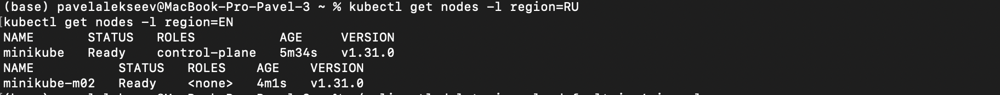
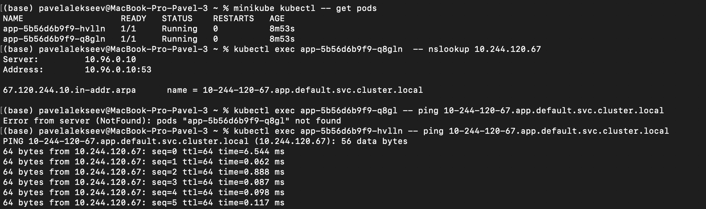

University: [ITMO University](https://itmo.ru/ru/)

  

Faculty: [FICT](https://fict.itmo.ru)

  

Course: [Introduction to distributed technologies](https://github.com/itmo-ict-faculty/introduction-to-distributed-technologies)

  

Year: 2023/2024

  

Group: K4111c

  

Author: Alekseev Pavel Alekseevich

  

Lab: Lab4

  

Date of create: 06.12.2024

Date of finished: 08.12.2024

  

# Лабораторная работа №4 "Сети связи в Minikube, CNI и CoreDNS."

  

## Описание

Это последняя лабораторная работа в которой вы познакомитесь с сетями связи в Minikube. Особенность Kubernetes заключается в том, что у него одновременно работают `underlay` и `overlay` сети, а управление может быть организованно различными CNI.

  

## Цель работы:

Познакомиться с CNI Calico и функцией `IPAM Plugin`, изучить особенности работы CNI и CoreDNS.

  

## Ход работы:

В процессе выполнения лабораторной работы были выполнены следующие шаги:

### 1. Запуск minikube.

При запуске minikube необходимо установить плагин `CNI=calico` и режим работы `Multi-Node Clusters` одновременно

```
minikube start --network-plugin=cni --cni=calico --nodes 2
```

 

### 2. Проверка количества нод.

Выполним команды:

```
kubectl get nodes
```
```
kubectl get pods -l k8s-app=calico-node -A
```

Количество подов должно совпадать с количеством нод:

 

 

### 3. Расставление меток на ноды.

Для нод расставили метки исходя из регионов. 

```
kubectl label nodes minikube region=RU && kubectl label nodes minikube-m02 region=EN
```


Проверка:

```
kubectl get nodes -l region=RU
kubectl get nodes -l region=EN
```



 
### 4. Создание манифеста calico.

Опишем следующий манифест

```

apiVersion: crd.projectcalico.org/v1

kind: IPPool

metadata:

name: ru-ippool

spec:

cidr: 192.168.10.0/24

ipipMode: Always

natOutgoing: true

nodeSelector: region == "RU"

  

---

  

apiVersion: crd.projectcalico.org/v1

kind: IPPool

metadata:

name: en-ippool

spec:

cidr: 192.168.20.0/24

ipipMode: Always

natOutgoing: true

nodeSelector: region == "EN"
```

  

-  `ipipMode` указывает, какой режим туннелирования используется.

-  `natOutgoing` разрешает подам использовать NAT для внешней сети.

-  `nodeSelector` указывает, какие ноды получат ip из этого пула.

  

 Сначала удаляем базовые настройки 

```
minikube kubectl -- delete ippools default-ipv4-ippool
```

Затем применяем наши

```
minikube kubectl -- apply -f ippool.yaml
```

  

### 5. Создание deployment и service .

Создали deployment и service, где теперь будем использовать сервис с LoadBallancer.

```

kubectl apply -f manifest.yaml

```

Проверим, что поды правильно разместились и получили правильные ip.

  


  

### 6. Подключение к подам.

Пробросили порты для подключения к нашим подам
```

minikube tunnel

```


  


  

#### Переменные Container name и Container IP

Переменные `Container name` и `Container IP` изменяются так как они индивидуальны для каждого контейнера.

  

### 7. Ping соседнего пода.

Узнаем FQDN

```

kubectl exec <First Pod name> -- nslookup <second pod ip>

```

По полученному FQDN пингуем

```

kubectl exec <First Pod name> -- ping <second pod fqdn>

```

  

  

### 8. Схема
  

